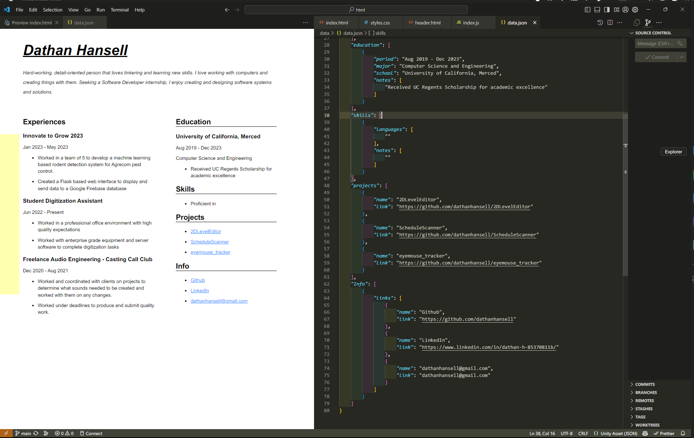

# resume
A simple js resume constructor from json data, built for easy and simple modification for resume tailoring

## Modification
If you want to modify the resume, all you have to do is find the attribute you want to modify from the base resume, then make a modified definition of that attribute in the mod.json file and that will temporarily overrwirte that part of the resume, so if you want to keep a specific version of your resume, all you need to do if keep that mod file.